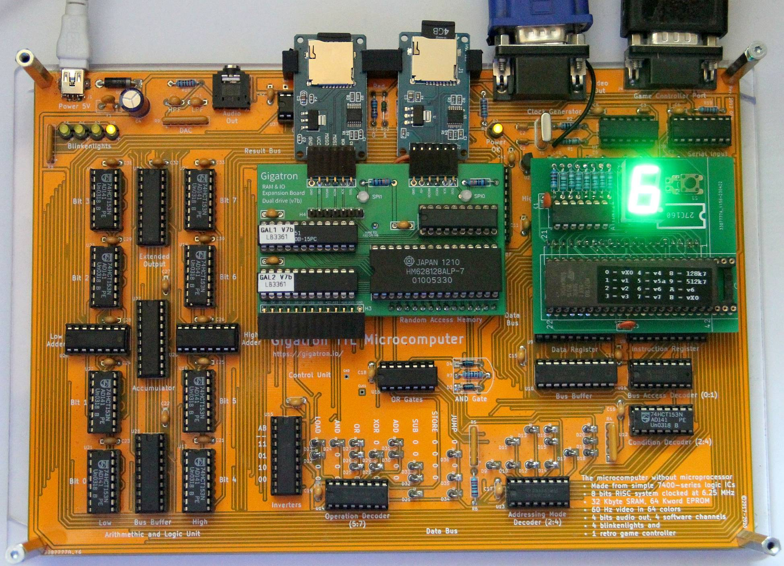
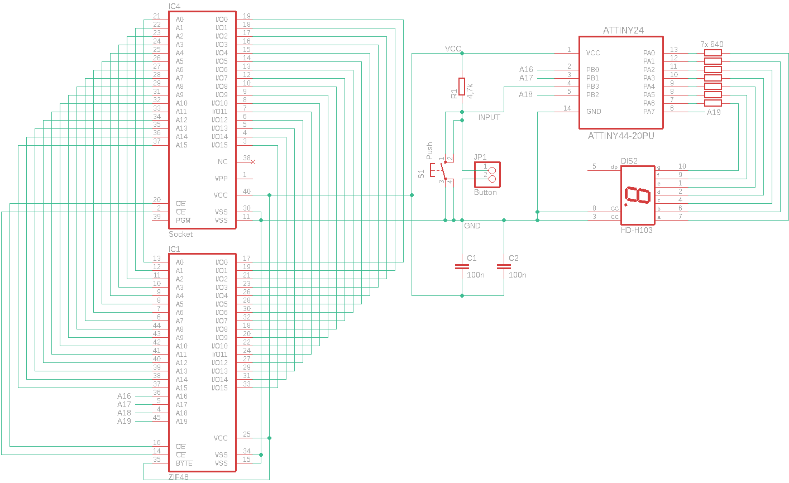
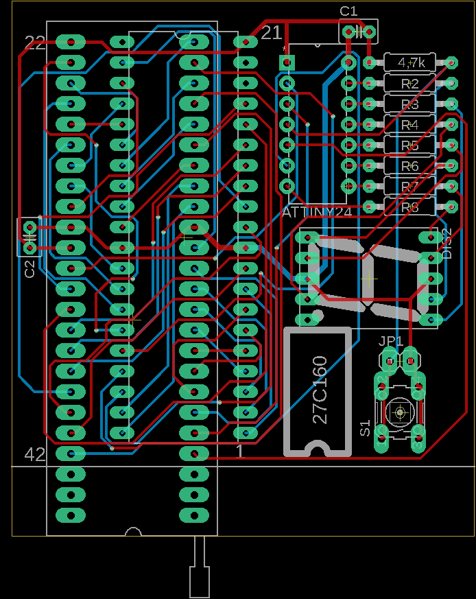

"# gtrom16" 

Switcher for 16 Gigatron ROM versions

The switch stores the last selected ROM in the EEPROM of the ATtiny24. This allows a reset by switching the Gigatron off/on. I have found only 10 different ROMs so far (v1, v2, v3, v4, v5a, v6, vX0, v7, 128k7, (512k7)).
When storing in EEPROM, I rotate the cells so that 6,300,000 ROM changes should be possible.

schematic

PCB

